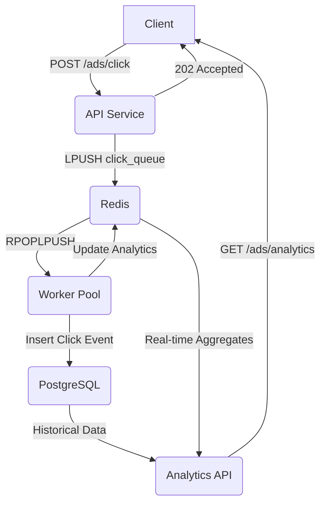
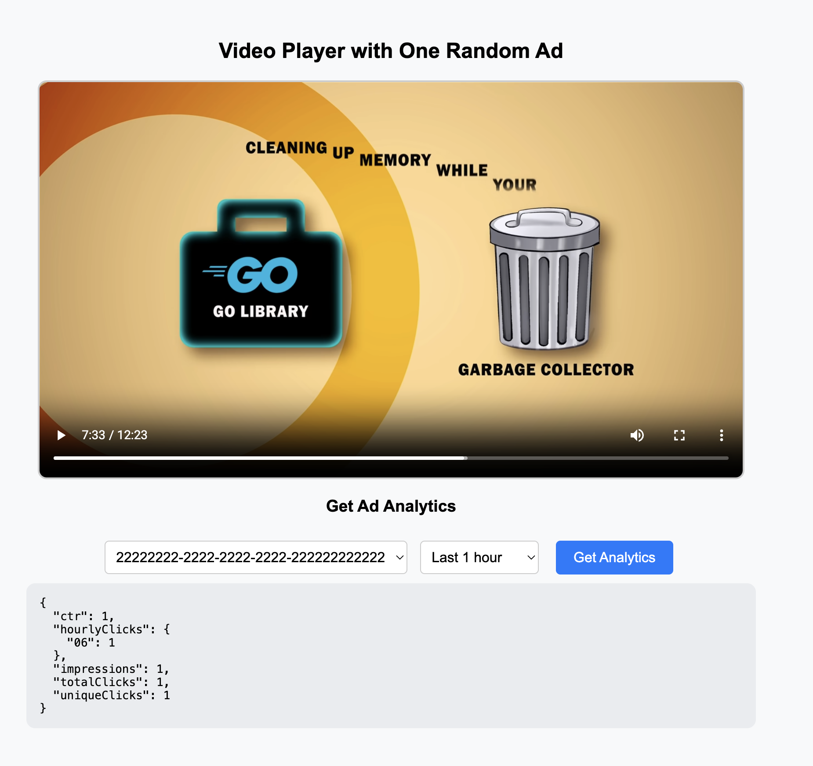
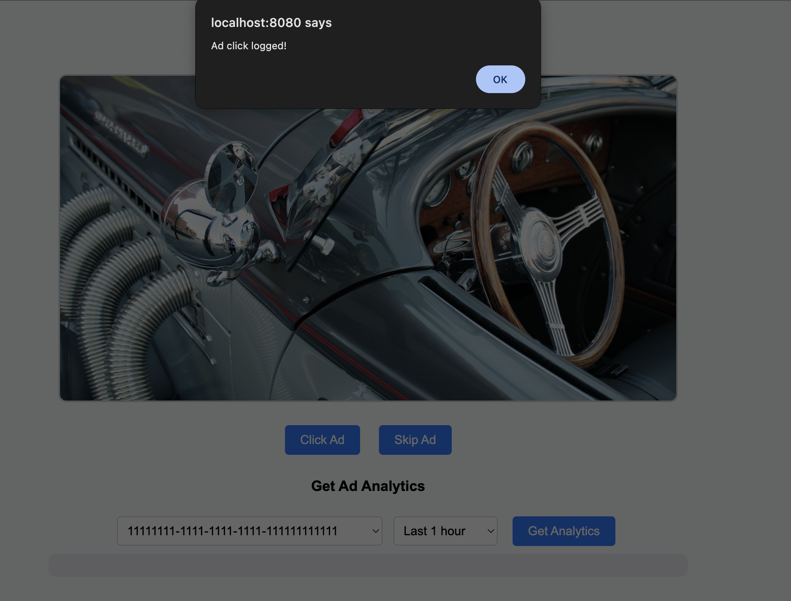
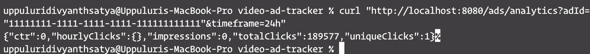
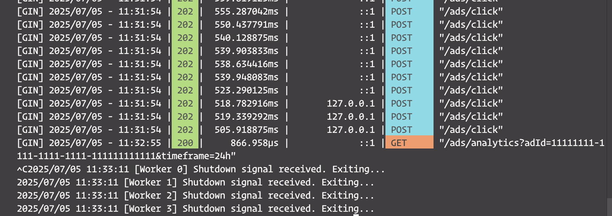
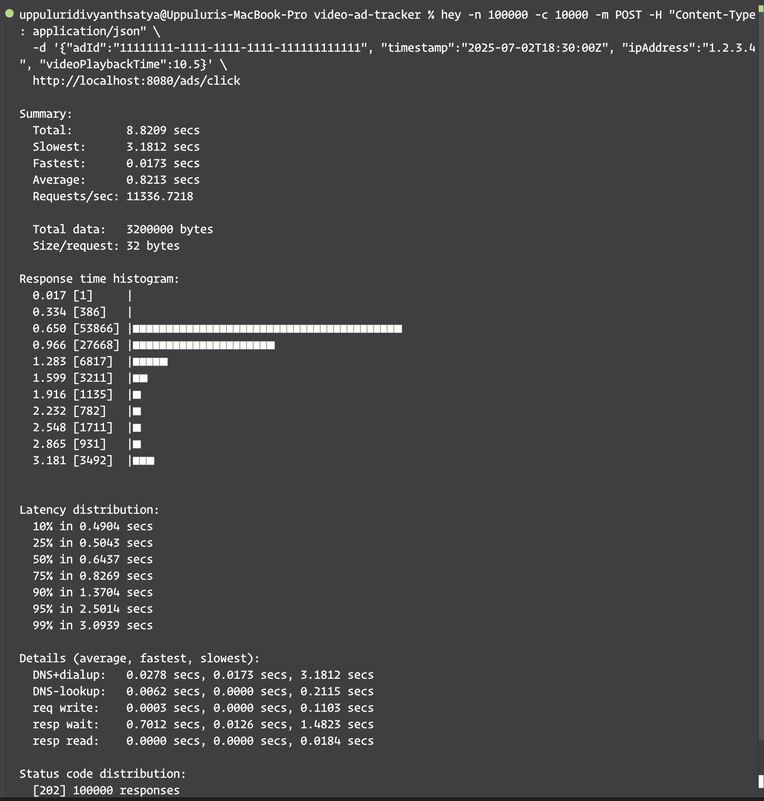

# Video Advertisement Tracking Backend [](https://github.com/Divyanth2468/video-ad-tracker/actions/workflows/ci.yml)

This project implements a robust and scalable GoLang backend for managing and tracking video advertisements. It is designed to handle high traffic, ensure data integrity through asynchronous processing, and provide real-time analytics.

---

## Table of Contents

- [Video Advertisement Tracking Backend ](#video-advertisement-tracking-backend-)
  - [Table of Contents](#table-of-contents)
  - [1. Overview](#1-overview)
  - [2. Features](#2-features)
  - [3. Architecture](#3-architecture)
    - [Component Breakdown](#component-breakdown)
    - [Asynchronous Click Processing Flow](#asynchronous-click-processing-flow)
  - [4. Setup \& Running](#4-setup--running)
    - [Prerequisites](#prerequisites)
    - [Clone Repository](#clone-repository)
    - [Environment Variables](#environment-variables)
    - [Build \& Run](#build--run)
    - [To Stop](#to-stop)
  - [5. API Documentation](#5-api-documentation)
    - [`GET /ads`](#get-ads)
    - [`POST /ads/impression`](#post-adsimpression)
    - [`POST /ads/click`](#post-adsclick)
    - [`GET /ads/analytics`](#get-adsanalytics)
    - [`GET /metrics`](#get-metrics)
  - [6. Demonstration \& Verification](#6-demonstration--verification)
    - [Access Web UI](#access-web-ui)
    - [Simulate Requests](#simulate-requests)
    - [For Load Testing](#for-load-testing)
  - [7. Resilience \& Data Integrity](#7-resilience--data-integrity)
  - [8. Scalability Considerations](#8-scalability-considerations)
  - [9. Future Enhancements](#9-future-enhancements)

---

## 1. Overview

This backend service provides APIs to manage video advertisements, track user interactions (clicks and impressions), and deliver real-time performance analytics. It leverages Go's concurrency features, Redis for high-speed queuing and analytics, and PostgreSQL for persistent data storage.

---

## 2. Features

- **Ad Management**: Retrieve a list of available ads.
- **Asynchronous Click Tracking**: Log user clicks efficiently without blocking the client, ensuring high throughput.
- **Impression Tracking**: Record ad impressions for CTR calculation.
- **Real-time Analytics**: Provide aggregated metrics like total clicks, unique clicks, impressions, and Click-Through Rate (CTR) over various timeframes.
- **Data Integrity**: All valid click events are recorded reliably, even under intermittent component failures.
- **Disk-based Fallback**: Persist click events to disk if Redis is down; periodically retry ingestion.
- **DLQ (Dead Letter Queue)**: Events that fail repeatedly are moved to a separate Redis list for inspection.
- **Scalability**: Designed to handle concurrent requests and traffic surges.
- **Production Readiness**: Containerized with Docker, configurable via environment variables, and exposes Prometheus metrics for monitoring.

---

## 3. Architecture

The system is designed with a multi-component architecture orchestrated by Docker Compose, emphasizing asynchronous processing for resilience and scalability.

### Component Breakdown

- **app (GoLang Service - `cmd/server`)**

  - API Server: Handles all incoming HTTP requests.
  - Redis Queue Producer: Queues clicks via LPUSH.
  - Worker Pool: Processes click events from Redis.
  - Fallback mechanism writes to `fallback_clicks.jsonl` if Redis fails.
  - Periodically flushes disk events back to Redis when available.

- **db (PostgreSQL Database)**

  - Stores ad metadata and raw click data.

- **redis (Redis Cache/Queue)**

  - Message Queue: Uses Redis Lists with RPOPLPUSH.
  - Real-time analytics: Stores click/impression counters.

### Asynchronous Click Processing Flow



---

## 4. Setup & Running

### Prerequisites

- Docker and Docker Compose
- Go (1.23+)

### Clone Repository

```bash
git clone https://github.com/Divyanth2468/video-ad-tracker.git
cd video-ad-tracker
```

### Environment Variables

Create a `.env` file:

```env
PORT=8080
DATABASE_URL="postgres://postgres:postgres@db:5432/videoadtracker?sslmode=disable"
REDIS_ADDR="redis:6379"
REDIS_PASSWORD=""
REDIS_DB=0
WORKER_COUNT=4
```

### Build & Run

```bash
docker-compose up --build -d
docker-compose ps
```

---

### To Stop

```bash
docker-compose down -v
```

---

## 5. API Documentation

### `GET /ads`

Returns a list of available ads.

**URL**: `http://localhost:8080/ads`

**Response**:

```json
[
  {
    "id": "ad_uuid_1",
    "video_url": "/assets/ads/ad1.mp4",
    "target_url": "http://example.com/product/1"
  }
]
```

---

### `POST /ads/impression`

Records an impression for CTR calculation.

**Request**:

```json
{
  "ad_id": "ad_uuid_1"
}
```

**Response**: `204 No Content`

---

### `POST /ads/click`

Asynchronously records a user click.

**Request**:

```json
{
  "adId": "ad_uuid_1",
  "timestamp": "2025-07-02T18:30:00Z",
  "ipAddress": "203.0.113.45",
  "videoPlaybackTime": 15.7
}
```

**Response**:

```json
{
  "message": "Click event queued"
}
```

---

### `GET /ads/analytics`

Fetch real-time ad metrics.

**Query Params**:

- `adId` (required)
- `timeframe`: 1h, 24h, 7d, all

**Sample Response**:

```json
{
  "totalClicks": 12500,
  "uniqueClicks": 8900,
  "impressions": 250000,
  "ctr": 0.05,
  "hourlyClicks": {
    "00": 500,
    "01": 300
  }
}
```

---

### `GET /metrics`

Prometheus-compatible metrics endpoint.

URL: `http://localhost:8080/metrics`

---

## 6. Demonstration & Verification

### Access Web UI

Open browser: `http://localhost:8080`

💡 Interface Previews
🎬 1. Ad Player Interface
Displays a randomly selected video ad with options to Click or Skip. Also includes dropdowns to fetch analytics.



✅ 2. Ad Click Confirmation
After a successful click, the user receives a confirmation popup from the backend.



📊 3. Ad Analytics Viewer
Shows real-time analytics including CTR, impressions, and hourly click breakdown for the selected ad.



⚙️ 4. Graceful Shutdown of Workers
Backend workers cleanly exit after receiving shutdown signals — preserving queue state.



🚀 5. Load Test Results (100k Requests)
hey benchmark results show response latency distribution and throughput across 100k concurrent POSTs.



### Simulate Requests

```bash
curl http://localhost:8080/ads

curl -X POST -H "Content-Type: application/json" \
  -d '{"ad_id": "11111111-1111-1111-1111-111111111111"}' http://localhost:8080/ads/impression

curl -X POST -H "Content-Type: application/json" \
  -d '{
    "adId": "11111111-1111-1111-1111-111111111111",
    "timestamp": "2025-07-02T18:30:00Z",
    "ipAddress": "192.168.1.1",
    "videoPlaybackTime": 15.7
}' http://localhost:8080/ads/click

curl "http://localhost:8080/ads/analytics?adId=ad_uuid_1&timeframe=24h"
```

### For Load Testing

```bash
hey -n 100000 -c 10000 -m POST -H "Content-Type: application/json" \
  -d '{"adId":"11111111-1111-1111-1111-111111111111", "timestamp":"2025-07-02T18:30:00Z", "ipAddress":"1.2.3.4", "videoPlaybackTime":10.5}' \
  http://localhost:8080/ads/click
```

---

## 7. Resilience & Data Integrity

- **Redis Queue + RPOPLPUSH** ensures atomic processing
- **DLQ** (`click_dead`) captures repeatedly failed events
- **Retries + Graceful Shutdown** handled via worker logic
- **Disk Fallback** stores failed events temporarily in `.jsonl`
- **PostgreSQL** used as source of truth
- **ON CONFLICT DO UPDATE** ensures deduplication

---

## 8. Scalability Considerations

- Stateless API enables horizontal scaling
- `WORKER_COUNT` controls concurrency
- Redis + Postgres scale independently
- Uses Go routines and channels for parallelism

---

## 9. Future Enhancements

- **Redis Streams** for better delivery guarantees
- **JWT-based Auth** for securing endpoints
